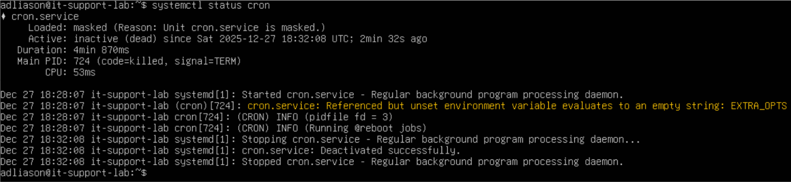
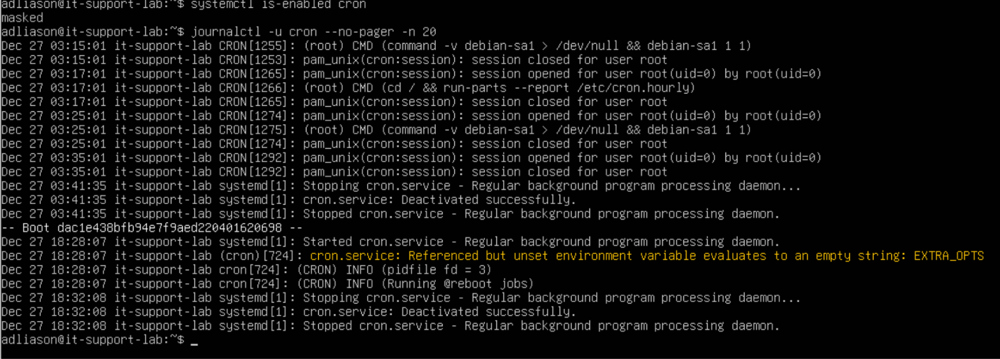
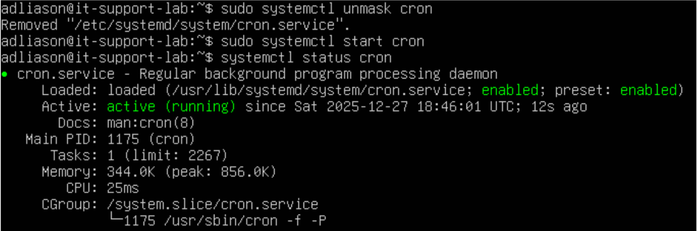

# Incident 3 — Service Fails to Start (cron)

## User-Reported Issue
A core background service was not running as expected, impacting scheduled system tasks.

---

## Validation
Checked the service status using systemd tools and confirmed that the service was not active.

---

## Diagnosis
Reviewed the service state and logs to determine whether the issue was caused by a crash or a configuration problem.
The service was found to be administratively masked, which prevents it from starting regardless of health.
Logs showed no fatal errors or crash loops.

---

## Root Cause
The `cron` service was masked at the systemd level, blocking it from starting normally.

---

## Resolution
Removed the administrative mask and restarted the service using systemctl.

---

## Verification
Confirmed the service is active and running normally after the fix.

---

## Commands Used
- `systemctl status cron` — check service state  
- `systemctl is-enabled cron` — confirm masked/enabled status  
- `journalctl -u cron` — review service logs  
- `systemctl unmask cron` — remove administrative block  
- `systemctl start cron` — restore service operation  

---

## Lessons Learned
- A masked service cannot start even if it is otherwise healthy  
- Always check service state before assuming a failure or crash  
- Logs help distinguish configuration issues from runtime errors  
