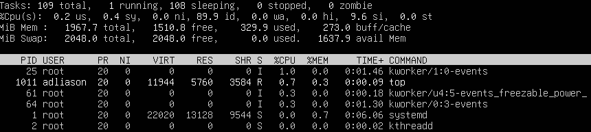
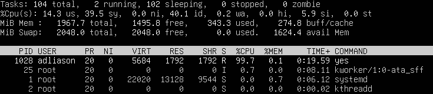
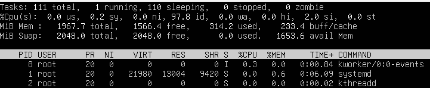

# Incident 4 — High CPU Usage / Runaway Process

## User-Reported Issue
The system became slow and unresponsive, with noticeable performance degradation during normal operation.

---

## Validation
Checked system performance to establish a baseline and confirmed that CPU utilization was initially within normal ranges.

---

## Diagnosis
Monitored real-time system activity and identified a runaway process consuming excessive CPU resources, significantly reducing system responsiveness.

---

## Root Cause
A runaway background process continuously consumed CPU cycles, leading to high system load and degraded performance.

---

## Resolution
The offending process was terminated and the system was stabilized to restore normal operation.

---

## Verification
Rechecked system performance and confirmed CPU utilization returned to normal levels and overall system responsiveness was restored.

---

## Commands Used
- `top` — monitor real-time CPU usage  
- `ps` — review running processes  
- Process termination (`pkill` / system recovery) — stop runaway process  

---

## Lessons Learned
- Runaway processes can rapidly impact system performance
- Real-time monitoring tools are essential for identifying CPU bottlenecks
- Stabilizing the system takes priority over perfect command execution
- Post-resolution verification confirms successful recovery
